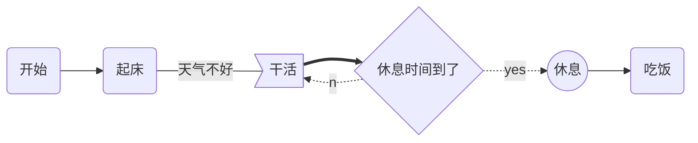
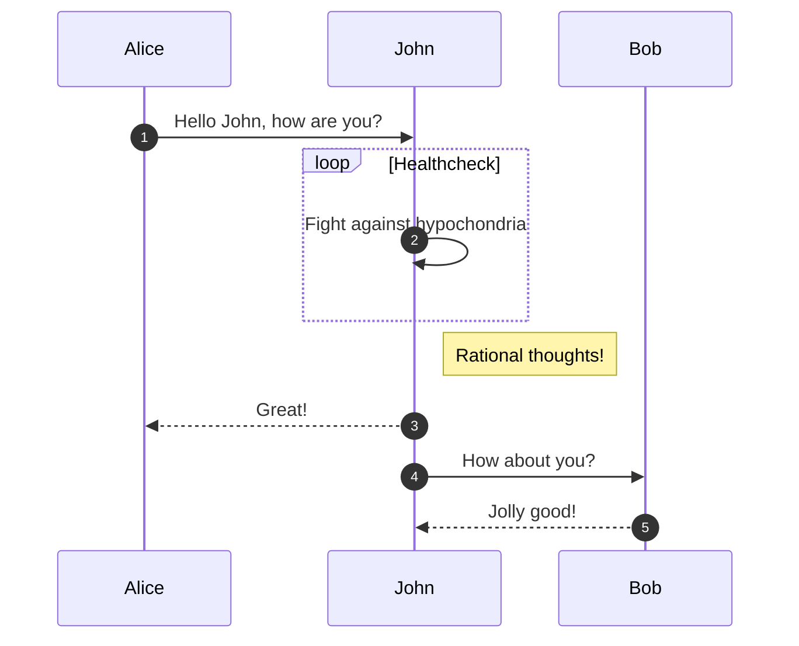
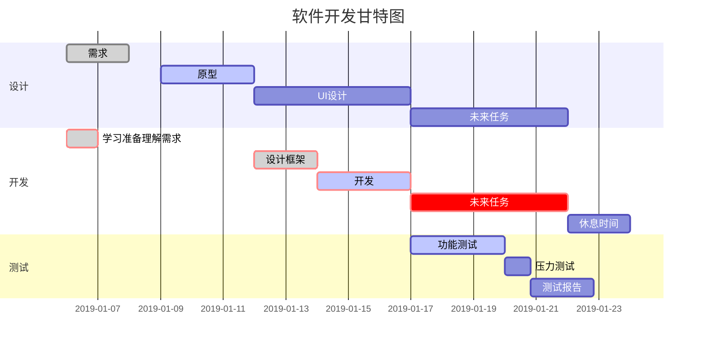

# 欢迎使用马克飞象

@(示例笔记本)[马克飞象|帮助|Markdown]

**马克飞象**是一款专为印象笔记（Evernote）打造的Markdown编辑器，通过精心的设计与技术实现，配合印象笔记强大的存储和同步功能，带来前所未有的书写体验。特点概述：

- **功能丰富** ：支持高亮代码块、*LaTeX* 公式、流程图，本地图片以及附件上传，甚至截图粘贴，工作学习好帮手；
- **得心应手** ：简洁高效的编辑器，提供[桌面客户端][1]以及[离线Chrome App][2]，支持移动端 Web；
- **深度整合** ：支持选择笔记本和添加标签，支持从印象笔记跳转编辑，轻松管理。

-------------------

[TOC]

## Markdown简介

> Markdown 是一种轻量级标记语言，它允许人们使用易读易写的纯文本格式编写文档，然后转换成格式丰富的HTML页面。    —— [维基百科](https://zh.wikipedia.org/wiki/Markdown)

正如您在阅读的这份文档，它使用简单的符号标识不同的标题，将某些文字标记为**粗体**或者*斜体*，创建一个[链接](http://www.example.com)或一个脚注[^demo]。下面列举了几个高级功能，更多语法请按`Ctrl + /`查看帮助。 

### 代码块
``` python
@requires_authorization
def somefunc(param1='', param2=0):
    '''A docstring'''
    if param1 > param2: # interesting
        print 'Greater'
    return (param2 - param1 + 1) or None
class SomeClass:
    pass
>>> message = '''interpreter
... prompt'''
```
### LaTeX 公式

可以创建行内公式，例如 $\Gamma(n) = (n-1)!\quad\forall n\in\mathbb N$。或者块级公式：

$$	x = \dfrac{-b \pm \sqrt{b^2 - 4ac}}{2a} $$

### 表格
| Item      |    Value | Qty  |
| :-------- | --------:| :--: |
| Computer  | 1600 USD |  5   |
| Phone     |   12 USD |  12  |
| Pipe      |    1 USD | 234  |

### 复选框

使用 `- [ ]` 和 `- [x]` 语法可以创建复选框，实现 todo-list 等功能。例如：

- [x] 已完成事项
- [ ] 待办事项1
- [ ] 待办事项2

> **注意：**目前支持尚不完全，在印象笔记中勾选复选框是无效、不能同步的，所以必须在**马克飞象**中修改 Markdown 原文才可生效。下个版本将会全面支持。


!!! note "Phasellus posuere in sem ut cursus"

    Lorem ipsum dolor sit amet, consectetur adipiscing elit. Nulla et euismod
    nulla. Curabitur feugiat, tortor non consequat finibus, justo purus auctor
    massa, nec semper lorem quam in massa.


!!! danger "Phasellus posuere in sem ut cursus"

    Lorem ipsum dolor sit amet, consectetur adipiscing elit. Nulla et euismod
    nulla. Curabitur feugiat, tortor non consequat finibus, justo purus auctor
    massa, nec semper lorem quam in massa.


## mermaid语法

### 一、流程图语法

graph 指定流程图方向：

- graph LR 横向，graph TD 纵向

元素的形状定义：

- id[描述] 以直角矩形绘制id(描述) 以圆角矩形绘制
- id{描述} 以菱形绘制
- id>描述] 以不对称矩形绘制
- id((描述)) 以圆形绘制

线条定义：

- A-->B 带箭头指向

- A---B 不带箭头连接

- A-.-B 虚线连接

- A-.->B 虚线指向

- A==>B 加粗箭头指向

- A--描述---B 不带箭头指向并在线段中间添加描述

- A--描述-->B 带描述的箭头指向

- A-.描述.->B 带描述的虚线连指向

- A==描述==>B 带描述的加粗箭头指向

子流程图定义subgraph titlegraph directionend

示例：

```
graph LR
A(开始)-->B(起床)
B --天气不好--- C>干活]
C ==> D{休息时间到了}
D -.yes.-> E((休息))
D -.no.-> C
E --> F(吃饭)
```





### 二、时序图语法

基本语法：

- Title:标题 ：指定时序图的标题

- Note direction of 对象:描述 ： 在对象的某一侧添加描述，direction 可以为 right/left/over ， 对象 可以是多个对象，以 , 作为分隔符

- participant 对象 ：创建一个对象

- loop...end ：创建一个循环体

- 对象A->对象B:描述 ： 绘制A与B之间的对话，以实线连接
  -  -> 实线实心箭头指向
  -  --> 虚线实心箭头指向
  - ->> 实线小箭头指向
  - -->> 虚线小箭头指向


开头使用关键字 sequenceDiagram 指明，

列子：

```
sequenceDiagram
  autonumber
  Alice->>John: Hello John, how are you?
  loop Healthcheck
      John->>John: Fight against hypochondria
  end
  Note right of John: Rational thoughts!
  John-->>Alice: Great!
  John->>Bob: How about you?
  Bob-->>John: Jolly good!
```





### 三、甘特图语法

基本语法：

- 使用 mermaid 解析语言，在开头使用关键字 gantt 指明

- deteFormat 格式 指明日期的显示格式

- title 标题 设置图标的标题

- section 描述 定义纵向上的一个环节

- 定义步骤：每个步骤有两种状态 done（已完成）/ active（执行中）

  - 描述: 状态,id,开始日期,结束日期/持续时间
  - 描述: 状态[,id],after id2,持续时间
  - crit ：可用于标记该步骤需要被修正，将高亮显示
  - 如果不指定具体的开始时间或在某个步骤之后，将默认依次顺序排列

例子：

```
gantt
dateFormat YYYY-MM-DD
title 软件开发甘特图
section 设计
需求:done,des1, 2019-01-06,2019-01-08
原型:active,des2, 2019-01-09, 3d
UI设计:des3, after des2, 5d
未来任务:des4, after des3, 5d

section 开发
学习准备理解需求:crit, done, 2019-01-06,24h
设计框架:crit, done, after des2, 2d
开发:crit, active, 3d
未来任务:crit, 5d
休息时间:2d

section 测试
功能测试:active, a1, after des3, 3d
压力测试:after a1, 20h
测试报告: 48h
```




> **提示：**想了解更多，请查看**流程图**[语法][3]以及**时序图**[语法][4]。


## 印象笔记相关

### 笔记本和标签
**马克飞象**增加了`@(笔记本)[标签A|标签B]`语法, 以选择笔记本和添加标签。 **绑定账号后**， 输入`(`自动会出现笔记本列表，请从中选择。

### 笔记标题
**马克飞象**会自动使用文档内出现的第一个标题作为笔记标题。例如本文，就是第一行的 `欢迎使用马克飞象`。

### 快捷编辑
保存在印象笔记中的笔记，右上角会有一个红色的编辑按钮，点击后会回到**马克飞象**中打开并编辑该笔记。
>**注意：**目前用户在印象笔记中单方面做的任何修改，马克飞象是无法自动感知和更新的。所以请务必回到马克飞象编辑。

### 数据同步
**马克飞象**通过**将Markdown原文以隐藏内容保存在笔记中**的精妙设计，实现了对Markdown的存储和再次编辑。既解决了其他产品只是单向导出HTML的单薄，又规避了服务端存储Markdown带来的隐私安全问题。这样，服务端仅作为对印象笔记 API调用和数据转换之用。

 >**隐私声明：用户所有的笔记数据，均保存在印象笔记中。马克飞象不存储用户的任何笔记数据。**

### 离线存储
**马克飞象**使用浏览器离线存储将内容实时保存在本地，不必担心网络断掉或浏览器崩溃。为了节省空间和避免冲突，已同步至印象笔记并且不再修改的笔记将删除部分本地缓存，不过依然可以随时通过`文档管理`打开。

> **注意：**虽然浏览器存储大部分时候都比较可靠，但印象笔记作为专业云存储，更值得信赖。以防万一，**请务必经常及时同步到印象笔记**。

## 编辑器相关
### 设置
右侧系统菜单（快捷键`Ctrl + M`）的`设置`中，提供了界面字体、字号、自定义CSS、vim/emacs 键盘模式等高级选项。

### 快捷键

帮助    `Ctrl + /`
同步文档    `Ctrl + S`
创建文档    `Ctrl + Alt + N`
最大化编辑器    `Ctrl + Enter`
预览文档 `Ctrl + Alt + Enter`
文档管理    `Ctrl + O`
系统菜单    `Ctrl + M` 

加粗    `Ctrl + B`
插入图片    `Ctrl + G`
插入链接    `Ctrl + L`
提升标题    `Ctrl + H`

[^demo]: 这是一个示例脚注。请查阅 [MultiMarkdown 文档](https://github.com/fletcher/MultiMarkdown/wiki/MultiMarkdown-Syntax-Guide#footnotes) 关于脚注的说明。 **限制：** 印象笔记的笔记内容使用 [ENML][5] 格式，基于 HTML，但是不支持某些标签和属性，例如id，这就导致`脚注`和`TOC`无法正常点击。


[1]: http://maxiang.info/client_zh
[2]: https://chrome.google.com/webstore/detail/kidnkfckhbdkfgbicccmdggmpgogehop
[3]: http://adrai.github.io/flowchart.js/
[4]: http://bramp.github.io/js-sequence-diagrams/
[5]: https://dev.yinxiang.com/doc/articles/enml.php
