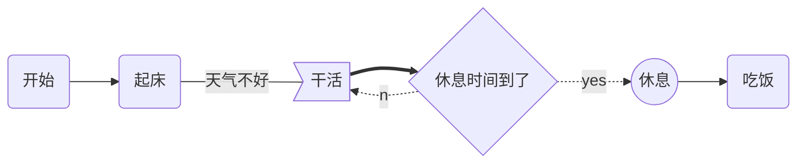
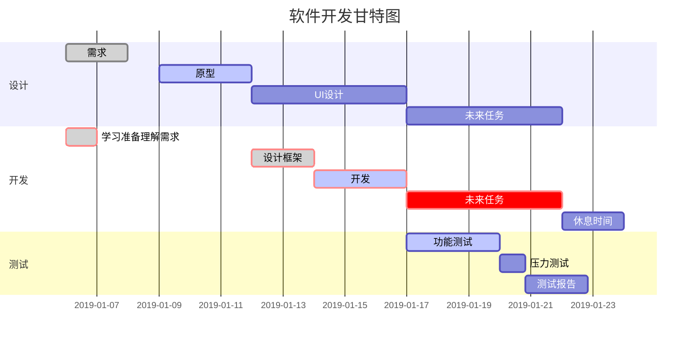

进入tools文件安装

1.typora-setup-x64（编辑.md文件使用）

2.pandoc.zip（将.md导出.docx文件使用）

md2docx.bat 放入对应文件夹，执行可批量导出word格式文档。


## 1.typora工具使用介绍

> 可以使用附录文件中typora-setup-x64.zip 工具进行解压安装

markdown具体语法可参考软件中`帮助->Markdown reference`

也可使用菜单栏中的`编辑、段落、格式`等进行相关编辑。

文档中图片路径**必须为相对路径**，存放在assets中

> 推荐设置

1.安装后可首先打开视图，显示大纲视图


2.编辑->图片工具->全局图像设置


设置为`复制图片到./assets 文件夹`


当需插入图片时，直接`截图 -> ctrl+v` 或 点击`编辑->图片工具->插入本地图片`


在文档中把绝对路径删除为相对路径


## 2.markdown文件引用语法


### 1. Markdown 引用同一个文件的某一标题

```
[title](#title)
```

1. 使用 `#` 选中章节
2. 将大写字母改成小写
3. 去掉括号 `（）` `。` `.` 等特殊字符
4. 空格用 `-` 替代
5. 标题必须唯一

### 2.Markdown 引用另一个文件

```
[title](./dir/file.md)
```

1. 可以用相对文件路径
2. 其它注意事项同上

### 3. Markdown 引用另一个文件的某一标题

```
[title](./dir/file.md#title)
```

1. 可以用相对文件路径
2. 其它注意事项同上


## mermaid语法

### 一、流程图语法

graph 指定流程图方向：

- graph LR 横向，graph TD 纵向

元素的形状定义：

- id[描述] 以直角矩形绘制id(描述) 以圆角矩形绘制
- id{描述} 以菱形绘制
- id>描述] 以不对称矩形绘制
- id((描述)) 以圆形绘制

线条定义：

- A-->B 带箭头指向

- A---B 不带箭头连接

- A-.-B 虚线连接

- A-.->B 虚线指向

- A==>B 加粗箭头指向

- A--描述---B 不带箭头指向并在线段中间添加描述

- A--描述-->B 带描述的箭头指向

- A-.描述.->B 带描述的虚线连指向

- A==描述==>B 带描述的加粗箭头指向

子流程图定义subgraph titlegraph directionend

示例：

```
graph LR
A(开始)-->B(起床)
B --天气不好--- C>干活]
C ==> D{休息时间到了}
D -.yes.-> E((休息))
D -.no.-> C
E --> F(吃饭)
```





### 二、时序图语法

基本语法：

- Title:标题 ：指定时序图的标题

- Note direction of 对象:描述 ： 在对象的某一侧添加描述，direction 可以为 right/left/over ， 对象 可以是多个对象，以 , 作为分隔符

- participant 对象 ：创建一个对象

- loop...end ：创建一个循环体

- 对象A->对象B:描述 ： 绘制A与B之间的对话，以实线连接
  -  -> 实线实心箭头指向
  -  --> 虚线实心箭头指向
  - ->> 实线小箭头指向
  - -->> 虚线小箭头指向


开头使用关键字 sequenceDiagram 指明，

列子：

```
sequenceDiagram
  Title:标题 ：指定时序图的标题
  Alice->>John: Hello John, how are you?
  loop Healthcheck
      John->>John: Fight against hypochondria
  end
  Note right of John: Rational thoughts!
  John-->>Alice: Great!
  John->>Bob: How about you?
  Bob-->>John: Jolly good!
  participant 观察者
```


```mermaid
sequenceDiagram
  Title:标题 ：指定时序图的标题
  Alice->>John: Hello John, how are you?
  loop Healthcheck
      John->>John: Fight against hypochondria
  end
  Note right of John: Rational thoughts!
  John-->>Alice: Great!
  John->>Bob: How about you?
  Bob-->>John: Jolly good!
  participant 观察者
```


### 三、甘特图语法

基本语法：

- 使用 mermaid 解析语言，在开头使用关键字 gantt 指明

- deteFormat 格式 指明日期的显示格式

- title 标题 设置图标的标题

- section 描述 定义纵向上的一个环节

- 定义步骤：每个步骤有两种状态 done（已完成）/ active（执行中）

  - 描述: 状态,id,开始日期,结束日期/持续时间
  - 描述: 状态[,id],after id2,持续时间
  - crit ：可用于标记该步骤需要被修正，将高亮显示
  - 如果不指定具体的开始时间或在某个步骤之后，将默认依次顺序排列

例子：

```
gantt
dateFormat YYYY-MM-DD
title 软件开发甘特图
section 设计
需求:done,des1, 2019-01-06,2019-01-08
原型:active,des2, 2019-01-09, 3d
UI设计:des3, after des2, 5d
未来任务:des4, after des3, 5d

section 开发
学习准备理解需求:crit, done, 2019-01-06,24h
设计框架:crit, done, after des2, 2d
开发:crit, active, 3d
未来任务:crit, 5d
休息时间:2d

section 测试
功能测试:active, a1, after des3, 3d
压力测试:after a1, 20h
测试报告: 48h
```


