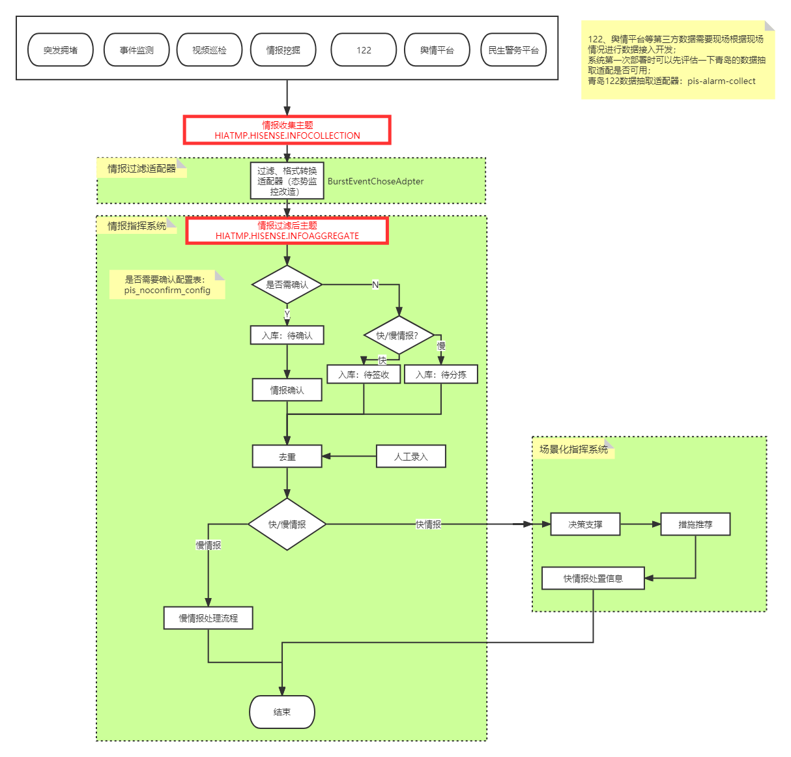

# 民意民声-舆情来源分类

## 1.基本信息

### 权限

暂无

### 扩展

暂无

### 历史记录

| 版本     | 开发人 | 需求描述                           | 时间          |
| -------- | ------ | ---------------------------------- | ------------- |
| 立项版本 | 李楠   | 展示有关车管所有关的舆情的来源分类 | 2022年7月13日 |
|          |        |                                    |               |

## 2.页面及接口设计

### 一级组件

```javascript
PublicSentimentChart: () => import("@/components/PeopleAnswerCard/PreachTypePieChart"), // 舆情分析饼图
```


#### 获取舆情来源数据接口

```javascript
POST '/HiatmpPro/cockpit/peopleVoice/getVoiceSourceNum'
```

##### 数据流

通过MQ、适配器等进行情报接入，数据最终流向PIS_INFO_BASE表，舆情分析时通过字段

```
            info_feature = '1'
            and info_stage != '06'
```

来筛选舆情信息



### 二级弹窗

暂无

### 地图下钻

暂无

## 3.依赖

### 数据库依赖表

| 表名                    | 中文名           | 所属库 | 数据来源         |
| ----------------------- | ---------------- | ------ | ---------------- |
| PIS_INFO_BASE           | 情报信息表       | 管控库 | 6.1情报分析      |
| PIS_PARAM_CONFIG        | 情报参数配置表   | 管控库 | 6.1情报分析      |
| PIS_GROUP               | 情报组表         | 管控库 | 6.1情报分析      |
| PIS_INFO_GROUP_RELATION | 情报组关联情报表 | 管控库 | 6.1情报分析      |
| DEPARTMENT              | 部门表           | 管控库 | 基础平台部门管理 |

### 服务依赖

| 服务名                      | 版本 | 备注 |
| --------------------------- | ---- | ---- |
| HiATMP-PIS6.0               |      |      |
| urbantraffic-hiatmp-cockpit |      |      |

### 其他依赖（适配器/大数据/现场系统等）

BurstEventChoseAdapter适配器、现场根据122等平台情况开发的定制适配器